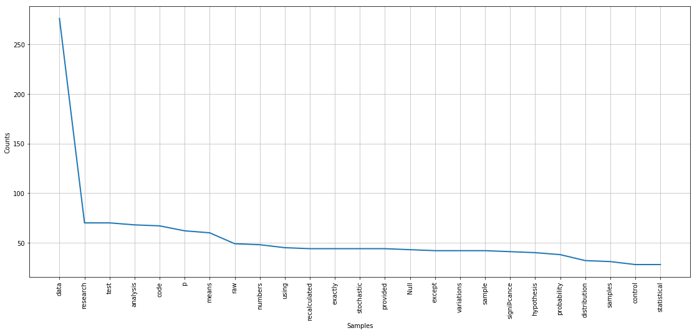
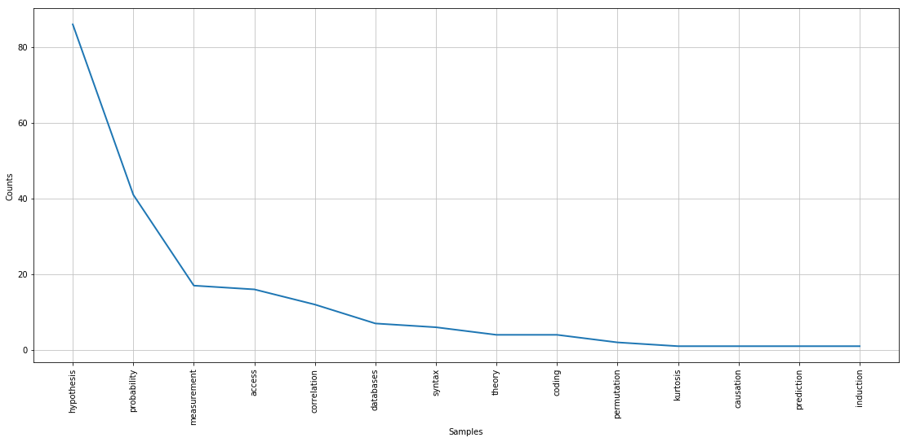

# HW11_um367

## Assigment 1

We learned to work with muultidimensional numpy data and whole array of axis dependent operations that come with it. Besides we trained non-linera classificaiton models using random forrest classifier on the metro turnstile dataset. I worked with Mark Bauer and Manrique Adrian.

## Assignment 2

### Original Plot
### Frequency Distribution 25 common Words in PUI Slides

#### Change request I got was to clean out the words which do not refer to concepts so that the graph can convey information about the content of the class.
Though the graph was initially meant ot be an insight into the general linguistic qualitites of the slides rather than the concepts. But this was an interesting suggestion. So I used a list of scientific methods (that I had because of my particiaption in a NLP project) , and filtered the text such that only words referreing to the concepts were kept. This required some cleaning and punctuation removal steps too. The cleaned graph is shown below.
### Changed Plot

